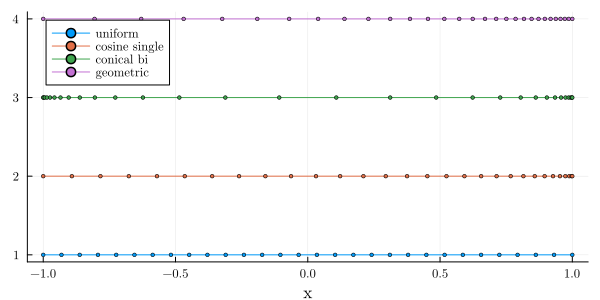

# GridSpacing.jl

Different grid spacing distributions:

- Cosine (bi/single)
- Conical (bi/single)
- Geometric

</img>

## Acknowledgements

https://github.com/mdolab/prefoil, released under Apache 2.0
Some parts of this code are ported to Julia, with some modifications.

## License

This code is licensed under Apache 2.0.